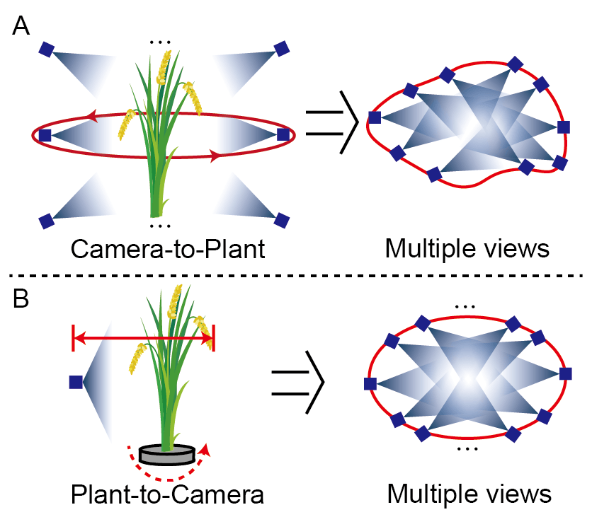
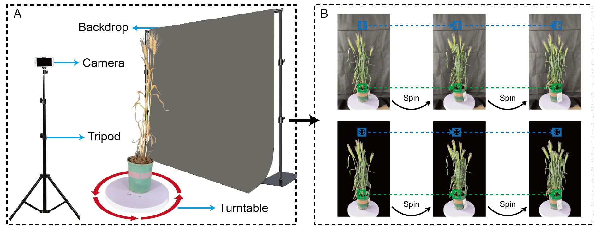
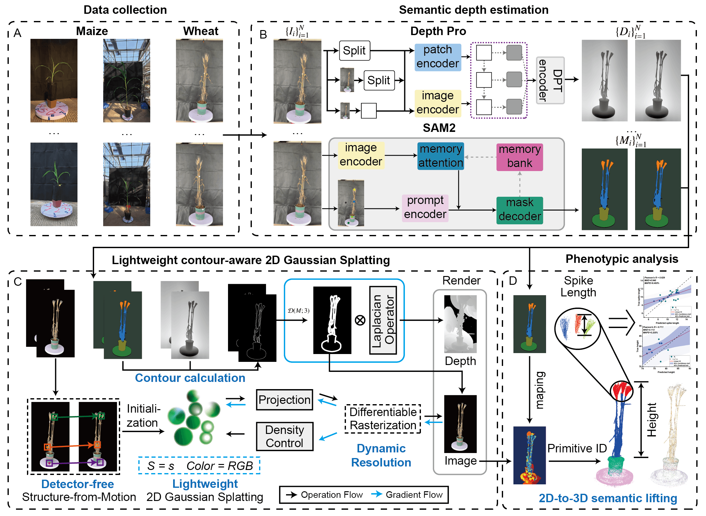
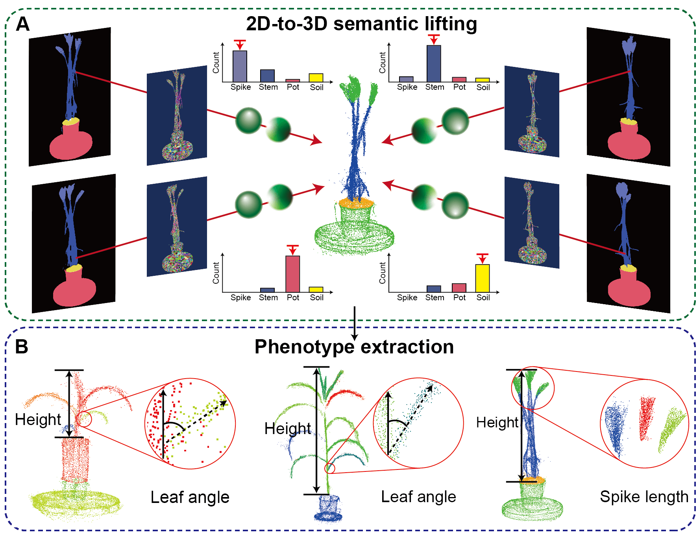
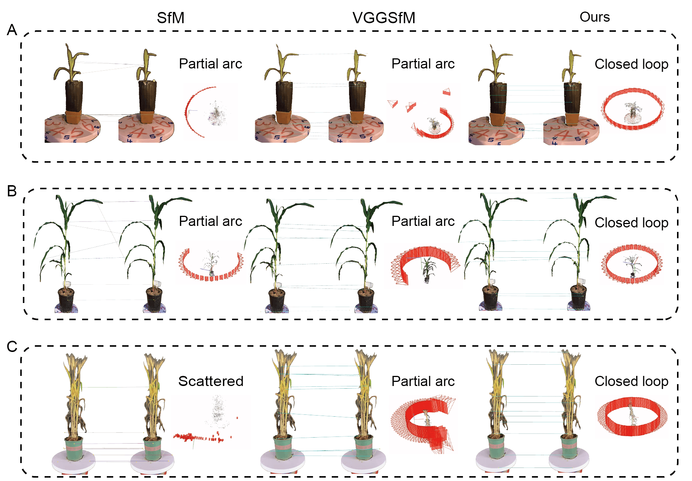
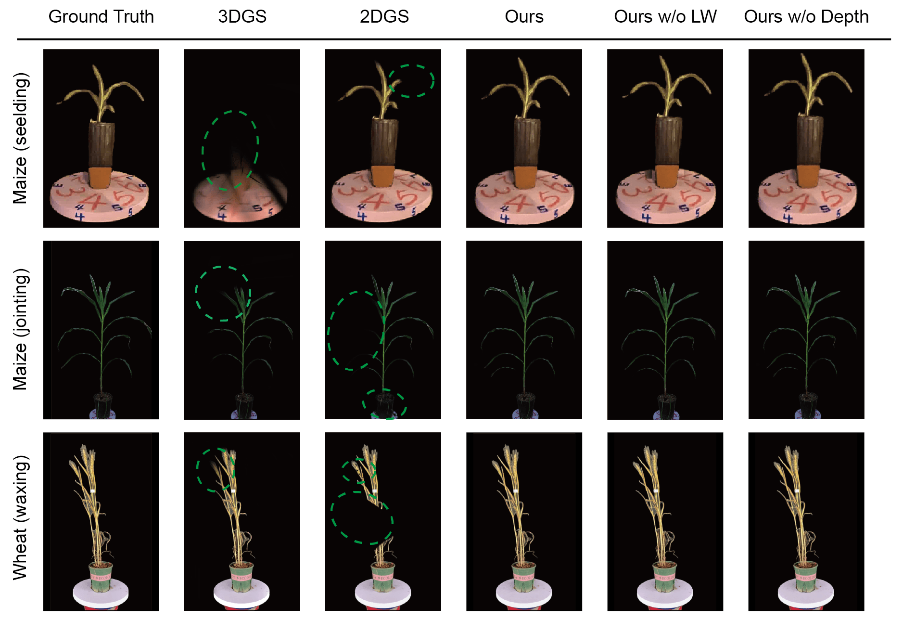
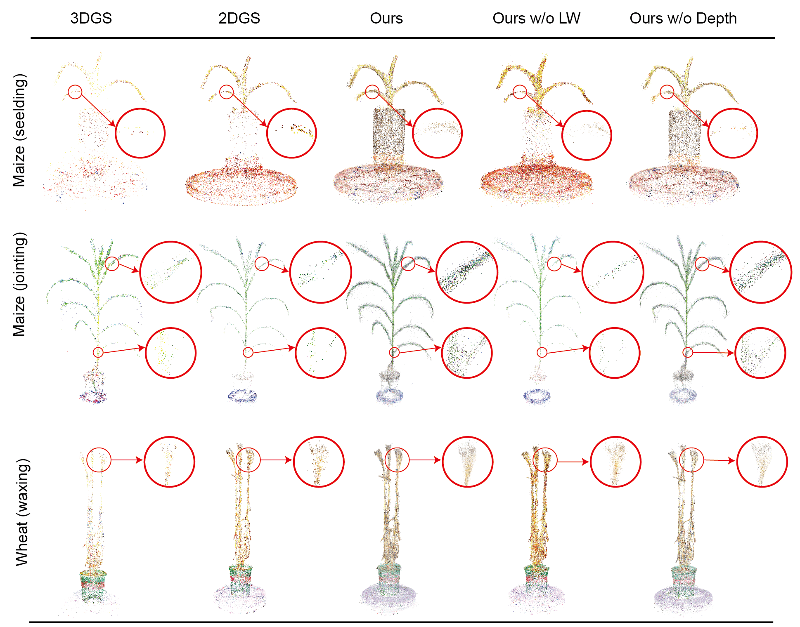
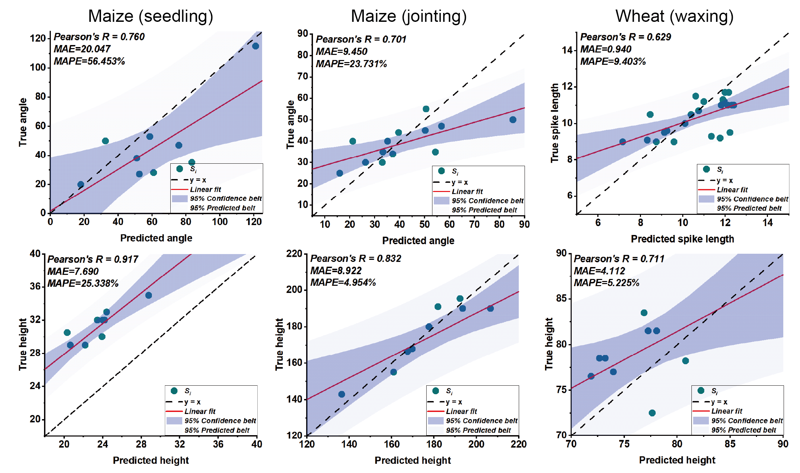

## 📖 Lightweight Contour-Aware 2D Gaussian Splatting under Plant-to-Camera

🔥 Segmentation-guided pose estimation enables robust Plant-to-Camera reconstruction. ⭐ Lightweight 2DGS representation improves geometric efficiency and fidelity. 🔥 2D-to-3D semantic lifting enables direct phenotypic analysis.

> Paper(Update after receiving)

Liang Zhao, Hanwen Tong, Hangyu Liu, Zhanwang Zhu, Weibing Jin, Yuping Zhong, Bo Wu, Weifu Li, Lin Li

> Huazhong Agricultural University
> Food Crops Institute, Hubei Academy of Agricultural Sciences
> National Key Laboratory of Crop Genetic Improvement
> Hubei Hongshan Laboratory
> Hubei Huichuzhi Biological Technolog

🚩 **Updates**

☑ A lightweight, semantic-aware framework for Plant-to-Camera 3D plant phenotyping.

☐ The code and data will be released after the paper's acceptance. Please stay tuned.

## Table of Contents
- [Plant-to-Camera setting](#plant-to-camera-setting)
- [RoSplat pipeline](#rosplat-pipeline)
- [Experimental results](#experimental-results)
- [Contact](#contact)

---

## Plant-to-Camera setting

  

<b>Fig. 1.</b> Acquisition modes for 3D plant modeling.
(A) Plant-to-Camera: multiple views are captured by moving the camera around the target plant.
(B) Camera-to-Plant: multiple views are captured by fixed-pose camera systems during plant rotation.

  

<b>Fig. 2.</b>
(A) Images are captured using a smartphone or a camera fixed on a tripod, with plants placed on a rotating turntable in front of a backdrop.
(B) Cross-view feature matching. Top: corresponding feature points matched from original image views.
Bottom: corresponding feature points matched from background-removed views.

---

## RoSplat pipeline

  

<b>Fig. 3.</b> Overview of the proposed 3D plant phenotyping pipeline.
(A) Multi-view image acquisition of maize and wheat.
(B) Semantic depth estimation combining foreground segmentation and depth priors to suppress background interference.
(C) Lightweight contour-aware 2D Gaussian Splatting for efficient and faithful reconstruction.
(D) 2D-to-3D semantic lifting enables direct extraction of phenotypic traits.

  

<b>Fig. 4.</b> 2D-to-3D semantic lifting for plant phenotype extraction.
(A) Pixel-level segmentation masks from multiple views are lifted to 2D Gaussian primitives and aggregated across views.
(B) Phenotypic traits derived from semantically labeled Gaussians, including plant height, leaf angle, and spike length.

---

## Experimental results

  

<b>Fig. 5.</b> Qualitative comparison of camera pose estimation under the plant-to-camera setting.
Results are shown for maize at seedling (A) and jointing (B) stages, and wheat at the waxing stage (C).
SfM and VGGSfM produce scattered trajectories, whereas the proposed method consistently yields closed-loop trajectories.

  

<b>Fig. 6.</b> Qualitative rendering comparison and ablation study.
From left to right: ground-truth images, 3DGS, 2DGS, the proposed method, and ablation results.
Green dashed circles indicate typical structural artifacts that are alleviated by the proposed method.

  

<b>Fig. 7.</b> Qualitative point cloud comparison and ablation study.
The proposed method yields denser and more coherent geometric reconstructions,
while removing the lightweight design or depth regularization introduces noise and structural degradation.

  

<b>Fig. 8.</b> Quantitative evaluation of phenotypic trait extraction.
Scatter plots compare predicted and manually measured values for leaf angle, plant height, and spike length.

---

### Contact
If you have any question or collaboration needs, please email zhao_liang@webmail.hzau.edu.cn.
## Acknowledgement
This study is based on [2d-gaussian-splatting](https://github.com/hbb1/2d-gaussian-splatting). We appreciate their great codes.